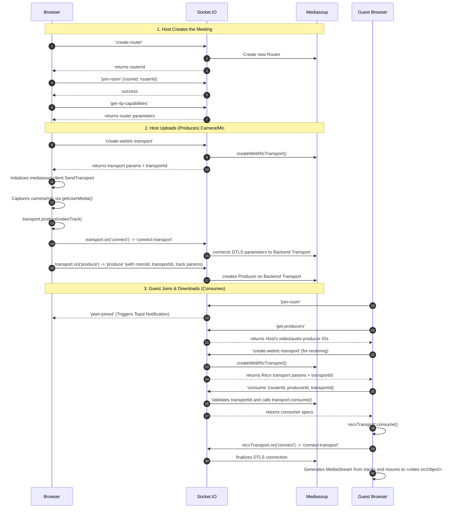

# Mediasoup Architecture & Technical Overview

This application is a modern WebRTC-based video conferencing platform powered by **Mediasoup** (as the Selective Forwarding Unit), **Socket.io** (for signaling), and **React** (for the premium user interface).

## Core Components

The architecture fundamentally relies on an SFU pattern. Unlike peer-to-peer (P2P) mesh networks where every user uploads their video stream to every other user directly (which destroys bandwidth for large meetings), an SFU acts as a smart central server. Clients upload their media exactly **once** to the Mediasoup backend, which then conditionally forwards/routes those streams to the other participants who request them.

### 1. The Backend (Node.js + Mediasoup)
The backend consists of an Express HTTP server sharing its port with a `Socket.io` instance, while spinning up low-level C++ Mediasoup `Workers`. 
- **Workers**: Mediasoup runs as a separate C++ process mapped to a Node.js worker object. This is what handles the massive throughput of raw UDP/TCP video and audio packets.
- **Routers**: Essentially "Rooms" in WebRTC taxonomy. When a user clicks *Start Meeting*, a Router is created. It represents an isolated arena where WebRTC Audio/Video tracks can be freely exchanged.
- **WebRtcTransports**: The literal WebRTC pipes bridging a user's browser with the server. A user has one transport for **Sending/Producing** (uploading their camera) and another distinct transport for **Receiving/Consuming** (downloading others' cameras).
- **Producers & Consumers**: Producer objects represent incoming tracks from the client. Consumer objects pull tracks from a Router and pipe them down to a receiving client.

### 2. The Signaling Layer (Socket.io)
Because WebRTC cannot discover peers or negotiate networking parameters autonomously, we use `socket.io` to exchange the prerequisite setup parameters (SDP/DTLS handshakes) out-of-band. 
- It manages high-level presence (`join-room`, `peer-joined`, `peer-left`).
- It facilitates WebRTC handshakes (fetching RTP capabilities, requesting WebRTC Transports, binding DTLS parameters).
- It tracks the map of who is currently producing what tracks via the `get-producers` request pipeline.

### 3. The Frontend (React + Vite + Tailwind CSS)
The frontend manages local application state, browser permissions, and UI binding.
- Uses `navigator.mediaDevices.getUserMedia` to acquire raw camera and microphone tracks.
- Runs an internal `setInterval` polling loop (`fetchAndConsume`) to constantly check if any participant in the room has recently started broadcasting a new track, guaranteeing late-joiners are effortlessly synchronized.
- Injects downloaded WebRTC MediaStreams perfectly into `<video>` refs, using specialized track-merging arrays and state guards to prevent the DOM from tearing or reloading needlessly.

## WebRTC Connection Flow (Sequence)

## Advanced Logic & Error Prevention
- **Avoiding the Promise Deadlock:** The `recvTransport.on('connect')` event in Mediasoup only fires *while* you try to `.consume()` tracks. It cannot be awaited proactively beforehand. By binding the listener gracefully, the client never hangs indefinitely waiting for a connection it hasn't provoked.
- **Video Element Re-render Throttling:** Unnecessary assignments to `HTMLVideoElement.srcObject` will cause standard browsers to dump the frame buffer and flicker black. The application utilizes a stringent `el.srcObject !== p.stream` verification to preserve seamless media rendering amid frantic React update cycles.
- **Track Merging:** Because Audio and Video are published as two entirely separate Producers, `fetchAndConsume` aggregates arriving tracks together into unified `MediaStream` objects to avoid audio unilaterally overwriting video arrays (and vice versa) in memory.
